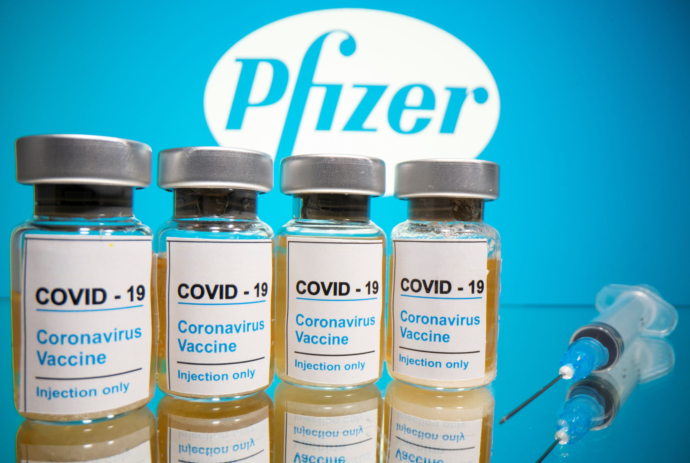

```{r, include = FALSE}
library(tidyverse)
```

<h6 style="text-align: left;" markdown="1">By: Qingyue Zhuo |  Baoyi Feng |  Yijin Wang |  Tvisha Devavarapu </h6>

<br></br>

<left>
<iframe width="840" height="472" src="https://www.youtube.com/embed/13lw6hl3EJ4" frameborder="0" allow="accelerometer; autoplay; clipboard-write; encrypted-media; gyroscope; picture-in-picture" allowfullscreen></iframe>
</left>


## Background

Since the discovery of multiple cases of COVID-19 in December 2019, the outbreak has spread rapidly across the globe, resulting in many infections and deaths and posing a significant threat to global public health security. Because no targeted drug is available, a vaccine for the coronavirus is critical to contain the spread of COVID-19. We currently have several major vaccines and booster vaccines available from Pfizer, Moderna, and Johnson & Johnson in NYC, which have shown promising results in reducing the overall infection rate.


<center class="half">



</center>


 
But inequities in global vaccine access are also becoming apparent. Due to systematic disparities in access to health resources, we are interested in exploring whether there exist disparities in vaccination rates across different races, ages, gender, and geographies in NYC. 

Taking the population in NYC as a whole, we are also interested in whether infection rate (first infections & reinfections) is associated with vaccination rate across time in NYC.

## Datasets

For the purpose of characterizing the pattern of the COVID-19 vaccination rate and infection rate in NYC over time:

* We used `doses by day data` to see the trends of getting shots of every vaccine. [Doses By Day Data](https://github.com/nychealth/covid-vaccine-data/blob/main/doses/doses-by-day.csv)

* We also filtered data of NYC on `Reinfection Data`, which gave us timely information about the trends in first infections and reinfections in New York City. [Reinfection Data](https://health.data.ny.gov/Health/New-York-State-Statewide-COVID-19-Reinfection-Data/7aaj-cdtu)

* We collected `Variant Data` from [Variant Data](https://coronavirus.health.ny.gov/covid-19-variant-data)

For exploring whether there exist disparities in vaccination rates across different races, ages, gender, and geographies:

* we traced back in history and merged all the data related to "coverge by demo" to `coverage by demo full data` and "coverage by boro demo" to `coverage boro demo full` from [People](https://github.com/nychealth/covid-vaccine-data/tree/main/people)


## Focus of our Project

Considering the area in NYC, knowing that the COVID-19 vaccine is effective, we aimed to show trends in vaccination rate and infection rate to roughly see the vaccine efficacy. And because of the existence of global vaccine disparities, we wanted to investigate associations between the vaccination rate and a range of demographic & geographic factors.


## Main Questions

We followed our exploratory by some detailed questions:

* What does the *trend* of every kind of cumulative vaccination rate in NYC over days look like? 

* What does the *trend* of every kind of daily vaccination rate over time look like? 

* What does the *trend* of infection rate over time look like, and is there any interesting information we can recognize when comparing this to the other two above? 

* What should be the *predictors* for vaccination rate? Also, is there a *significant association* between vaccination rate and races / ages / gender / boroughs?

* any predicted model? 


## Take away

some conclusion

## Our team

* Qingyue Zhuo
* Baoyi Feng
* Yijin Wang
* Tvisha Devavarapu

## References

### Photo references: 
* Pfizer https://images.app.goo.gl/ncW8utUJiZw8cobn9
* Moderna https://images.app.goo.gl/GDdVNvuDqUoZmSjg9
* Johnson https://images.app.goo.gl/edZzYCwC18VPiGto8

