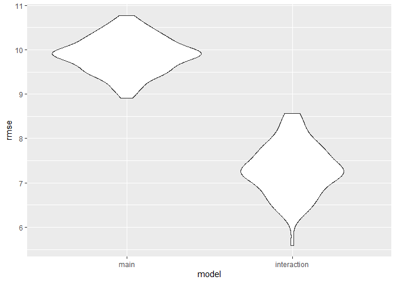

Statistical Analysis
================
Qingyue Zhuo qz2493
2022-12-01

### Selection of Predictors

- Data Cleaning

``` r
stratified = 
  read_csv("https://raw.githubusercontent.com/Serena-Wang/p8105_covid_vaccinations/main/Data/coverage_by_demo_full.csv") %>%
  janitor::clean_names() %>%
  select(group, subgroup, perc_partially, perc_fully, perc_additional) %>%
  drop_na()
```

    ## Rows: 30352 Columns: 13
    ## ── Column specification ────────────────────────────────────────────────────────
    ## Delimiter: ","
    ## chr  (3): POPULATION, GROUP, SUBGROUP
    ## dbl  (9): POP_DENOMINATOR, COUNT_PARTIALLY_CUMULATIVE, COUNT_FULLY_CUMULATIV...
    ## date (1): DATE
    ## 
    ## ℹ Use `spec()` to retrieve the full column specification for this data.
    ## ℹ Specify the column types or set `show_col_types = FALSE` to quiet this message.

``` r
unstratified = 
  read_csv("https://raw.githubusercontent.com/Serena-Wang/p8105_covid_vaccinations/main/Data/coverage_boro_demo_full.csv") %>%
  janitor::clean_names() %>%
  select(age_group, race_ethnicity, city_perc_fully) %>%
  filter(
    !age_group %in% c("Boroughwide", "All ages", "65+", "13-17", "18-44", "45-64") 
)
```

    ## Rows: 9233 Columns: 15
    ## ── Column specification ────────────────────────────────────────────────────────
    ## Delimiter: ","
    ## chr   (2): AGE_GROUP, RACE_ETHNICITY
    ## dbl  (12): CITY_COUNT_FULLY_CUMULATIVE, BX_COUNT_FULLY_CUMULATIVE, BK_COUNT_...
    ## date  (1): DATE
    ## 
    ## ℹ Use `spec()` to retrieve the full column specification for this data.
    ## ℹ Specify the column types or set `show_col_types = FALSE` to quiet this message.

- Data Cleaning

#### Chi-square Test

- Boroughs

We predicted that there is no difference in vaccination rate in NYC
across the six boroughs. We will perform the chi-square test to verify
our assumption.

H0: the expected vaccination rates are the same across all boroughs.

H1: the expected vaccination rate are not same across all boroughs.

``` r
demo_boro = 
  stratified %>%
  filter(group == "Borough") %>% 
  select(-group) %>%
  group_by(subgroup) %>%
  summarise(
    partial_vaccin = mean(perc_partially),
    full_vaccin = mean(perc_fully),
    additional_vaccin = mean(perc_additional))

knitr::kable(demo_boro, digits = 3)
```

| subgroup      | partial_vaccin | full_vaccin | additional_vaccin |
|:--------------|---------------:|------------:|------------------:|
| Bronx         |          9.072 |      72.518 |            22.140 |
| Brooklyn      |          7.310 |      66.726 |            25.867 |
| Citywide      |          9.174 |      75.148 |            29.566 |
| Manhattan     |         16.164 |      84.287 |            41.053 |
| Queens        |          8.193 |      84.039 |            33.356 |
| Staten Island |          6.248 |      67.901 |            25.183 |

``` r
chisq.test(demo_boro$partial_vaccin)
```

    ## 
    ##  Chi-squared test for given probabilities
    ## 
    ## data:  demo_boro$partial_vaccin
    ## X-squared = 6.5874, df = 5, p-value = 0.2532

``` r
chisq.test(demo_boro$full_vaccin)
```

    ## 
    ##  Chi-squared test for given probabilities
    ## 
    ## data:  demo_boro$full_vaccin
    ## X-squared = 3.9002, df = 5, p-value = 0.5639

``` r
chisq.test(demo_boro$additional_vaccin)
```

    ## 
    ##  Chi-squared test for given probabilities
    ## 
    ## data:  demo_boro$additional_vaccin
    ## X-squared = 7.9357, df = 5, p-value = 0.1598

Interpretation: The result of chi-square shows that χ2\<χcrit, at
significant level α=0.05, so we fail to reject the null hypothesis and
conclude that the vaccination rate is same across all boroughs.

- Race

We predicted that there is no difference in vaccination rate in NYC
across the six types of race. We will perform the chi-square test to
verify our assumption.

H0: the expected vaccination rates are the same across all races.

H1: the expected vaccination rates are not same across all races.

``` r
demo_race = 
  stratified %>%
  filter(group == "Race/ethnicity") %>%
  select(-group) %>%
  group_by(subgroup) %>%
  summarise(
    partial_vaccin = mean(perc_partially),
    full_vaccin = mean(perc_fully),
    additional_vaccin = mean(perc_additional))

knitr::kable(demo_race, digit = 3)
```

| subgroup                      | partial_vaccin | full_vaccin | additional_vaccin |
|:------------------------------|---------------:|------------:|------------------:|
| Asian/NHPI                    |          7.882 |     104.125 |            53.442 |
| Black                         |          6.813 |      57.773 |            18.627 |
| Hispanic/Latino               |         11.116 |      71.999 |            21.893 |
| Multiracial                   |          0.550 |       4.834 |             1.860 |
| Native American/Alaska Native |          9.562 |     105.141 |            48.512 |
| White                         |          4.715 |      55.500 |            29.519 |

``` r
chisq.test(demo_race$partial_vaccin)
```

    ## 
    ##  Chi-squared test for given probabilities
    ## 
    ## data:  demo_race$partial_vaccin
    ## X-squared = 10.458, df = 5, p-value = 0.06326

``` r
chisq.test(demo_race$full_vaccin)
```

    ## 
    ##  Chi-squared test for given probabilities
    ## 
    ## data:  demo_race$full_vaccin
    ## X-squared = 104.25, df = 5, p-value < 2.2e-16

``` r
chisq.test(demo_race$additional_vaccin)
```

    ## 
    ##  Chi-squared test for given probabilities
    ## 
    ## data:  demo_race$additional_vaccin
    ## X-squared = 64.644, df = 5, p-value = 1.329e-12

Interpretation: The result of chi-square shows that p-value for partial
vaccination rate is greater than 0.05, while p-values for full and
additional vaccination rates are smaller than the significant value
α=0.05, so we can conclude that partial vaccination rate is same across
all races, while full and additional vaccination rates are difference
across races in NYC.

- Sex

We predicted that there is no difference in vaccination rate in NYC
across genders. We will perform the chi-square test to verify our
assumption.

H0: the expected vaccination rates are the same across genders.

H1: the expected vaccination rates are not same across all genders.

``` r
demo_sex = 
  stratified %>%
  filter(group == "Sex") %>%
  select(-group) %>%
  group_by(subgroup) %>%
  summarise(
    partial_vaccin = mean(perc_partially),
    full_vaccin = mean(perc_fully),
    additional_vaccin = mean(perc_additional))

knitr::kable(demo_sex)
```

| subgroup | partial_vaccin | full_vaccin | additional_vaccin |
|:---------|---------------:|------------:|------------------:|
| Female   |       8.810231 |    75.46071 |          30.82645 |
| Male     |       9.354950 |    73.69736 |          27.76276 |

``` r
chisq.test(demo_sex$partial_vaccin)
```

    ## 
    ##  Chi-squared test for given probabilities
    ## 
    ## data:  demo_sex$partial_vaccin
    ## X-squared = 0.016335, df = 1, p-value = 0.8983

``` r
chisq.test(demo_sex$full_vaccin)
```

    ## 
    ##  Chi-squared test for given probabilities
    ## 
    ## data:  demo_sex$full_vaccin
    ## X-squared = 0.020846, df = 1, p-value = 0.8852

``` r
chisq.test(demo_sex$additional_vaccin)
```

    ## 
    ##  Chi-squared test for given probabilities
    ## 
    ## data:  demo_sex$additional_vaccin
    ## X-squared = 0.1602, df = 1, p-value = 0.689

Interpretation: The result of chi-square shows that χ2\<χcrit, at
significant level α=0.05, so we fail to reject the null hypothesis and
conclude that the vaccination rate is same for male and female.

- age

We predicted that there is no difference in vaccination rate in NYC
across differenc age groups. We will perform the chi-square test to
verify our assumption.

H0: the expected vaccination rates are the same across age groups.

H1: the expected vaccination rate are not same across age groups.

``` r
demo_age = 
  stratified %>%
  filter(
    group == "Age",
    subgroup != "'5-12",
    subgroup != "'0-4",
    subgroup != "'13-17") %>%
  select(-group) %>% 
  group_by(subgroup) %>%
  summarise(
    partial_vaccin = mean(perc_partially),
    full_vaccin = mean(perc_fully),
    additional_vaccin = mean(perc_additional))

knitr::kable(demo_age, digits = 3)
```

| subgroup | partial_vaccin | full_vaccin | additional_vaccin |
|:---------|---------------:|------------:|------------------:|
| ’0-17    |          6.328 |      41.527 |             8.485 |
| ’18-24   |         17.723 |      88.268 |            34.335 |
| ’25-34   |         12.244 |      83.049 |            35.413 |
| ’35-44   |          9.924 |      92.744 |            42.806 |
| ’45-54   |          7.879 |      91.979 |            48.690 |
| ’55-64   |          6.877 |      92.948 |            56.518 |
| ’65-74   |          6.201 |      90.296 |            63.019 |
| ’75-84   |          5.526 |      79.783 |            57.055 |
| ’85+     |          4.887 |      63.939 |            42.048 |

``` r
chisq.test(demo_age$partial_vaccin)
```

    ## 
    ##  Chi-squared test for given probabilities
    ## 
    ## data:  demo_age$partial_vaccin
    ## X-squared = 15.764, df = 8, p-value = 0.04589

``` r
chisq.test(demo_age$full_vaccin)
```

    ## 
    ##  Chi-squared test for given probabilities
    ## 
    ## data:  demo_age$full_vaccin
    ## X-squared = 29.727, df = 8, p-value = 0.0002362

``` r
chisq.test(demo_age$additional_vaccin)
```

    ## 
    ##  Chi-squared test for given probabilities
    ## 
    ## data:  demo_age$additional_vaccin
    ## X-squared = 49.548, df = 8, p-value = 4.991e-08

Interpretation: The result of chi-square shows that χ2\>χcrit, at
significant level α=0.05, so we reject the null hypothesis and conclude
that the vaccination rate is not same for difference age groups.  

Conclusion: according to the results of chi-square test, we can conclude
that race and age are significant predictors of the vaccination rate in
NYC, so we will fit the model with these two predictors.

### Model Fitting

We propose 2 models for prediction:

1.  Linear Model of city_perc_fully \~ age_group + race_ethnicity

2.  Linear Model of city_perc_fully \~ age_group + race_ethnicity +
    age_group \* race_ethnicity, assuming that there are interaction

- Main Effect Model

``` r
fit_lm_main = lm(city_perc_fully ~ age_group  +  race_ethnicity, 
                 data = unstratified )
fit_lm_main  %>% broom::tidy() %>% knitr::kable(digits = 2)
```

| term                          | estimate | std.error | statistic | p.value |
|:------------------------------|---------:|----------:|----------:|--------:|
| (Intercept)                   |    29.83 |      0.94 |     31.78 |       0 |
| age_group’13-17               |    73.06 |      0.96 |     75.93 |       0 |
| age_group’18-44               |    74.81 |      0.96 |     77.76 |       0 |
| age_group’45-64               |    79.41 |      0.96 |     82.54 |       0 |
| age_group’5-12                |    42.17 |      0.96 |     43.83 |       0 |
| age_group’65+                 |    73.94 |      0.96 |     76.85 |       0 |
| race_ethnicityBlack           |   -41.28 |      0.41 |   -100.96 |       0 |
| race_ethnicityHispanic/Latino |   -27.57 |      0.41 |    -67.43 |       0 |
| race_ethnicityWhite           |   -40.44 |      0.41 |    -98.91 |       0 |

- Interaction Model

``` r
fit_lm_interaction = lm(city_perc_fully ~ age_group  +  race_ethnicity +
                        age_group * race_ethnicity, 
                        data = unstratified )
fit_lm_interaction  %>% broom::tidy() %>% knitr::kable(digits = 2)
```

| term                                          | estimate | std.error | statistic | p.value |
|:----------------------------------------------|---------:|----------:|----------:|--------:|
| (Intercept)                                   |     4.32 |      1.33 |      3.25 |    0.00 |
| age_group’13-17                               |   110.21 |      1.41 |     78.04 |    0.00 |
| age_group’18-44                               |    97.70 |      1.41 |     69.18 |    0.00 |
| age_group’45-64                               |    96.80 |      1.41 |     68.55 |    0.00 |
| age_group’5-12                                |    79.58 |      1.41 |     56.35 |    0.00 |
| age_group’65+                                 |    89.97 |      1.41 |     63.71 |    0.00 |
| race_ethnicityBlack                           |    -3.87 |      1.88 |     -2.06 |    0.04 |
| race_ethnicityHispanic/Latino                 |    -3.77 |      1.88 |     -2.01 |    0.04 |
| race_ethnicityWhite                           |     0.38 |      1.88 |      0.20 |    0.84 |
| age_group’13-17:race_ethnicityBlack           |   -51.50 |      2.00 |    -25.79 |    0.00 |
| age_group’18-44:race_ethnicityBlack           |   -38.98 |      2.00 |    -19.52 |    0.00 |
| age_group’45-64:race_ethnicityBlack           |   -27.07 |      2.00 |    -13.55 |    0.00 |
| age_group’5-12:race_ethnicityBlack            |   -51.53 |      2.00 |    -25.80 |    0.00 |
| age_group’65+:race_ethnicityBlack             |   -22.87 |      2.00 |    -11.45 |    0.00 |
| age_group’13-17:race_ethnicityHispanic/Latino |   -33.06 |      2.00 |    -16.55 |    0.00 |
| age_group’18-44:race_ethnicityHispanic/Latino |   -17.36 |      2.00 |     -8.69 |    0.00 |
| age_group’45-64:race_ethnicityHispanic/Latino |   -11.50 |      2.00 |     -5.76 |    0.00 |
| age_group’5-12:race_ethnicityHispanic/Latino  |   -44.51 |      2.00 |    -22.29 |    0.00 |
| age_group’65+:race_ethnicityHispanic/Latino   |   -15.71 |      2.00 |     -7.87 |    0.00 |
| age_group’13-17:race_ethnicityWhite           |   -64.06 |      2.00 |    -32.08 |    0.00 |
| age_group’18-44:race_ethnicityWhite           |   -35.23 |      2.00 |    -17.64 |    0.00 |
| age_group’45-64:race_ethnicityWhite           |   -30.99 |      2.00 |    -15.52 |    0.00 |
| age_group’5-12:race_ethnicityWhite            |   -53.63 |      2.00 |    -26.85 |    0.00 |
| age_group’65+:race_ethnicityWhite             |   -25.55 |      2.00 |    -12.79 |    0.00 |

### Cross Validation

The predictors we chose above are statistically significant. What’s
more, we notice that interaction terms are contributing to model
predictability. We would say the interaction model will be better than
the other one because its root means square error seems to be smaller.
Therefore, interaction model could be useful for predicting the fully
vaccinated rate in NYC.

``` r
cv_df =
  crossv_mc(unstratified, 100) %>% 
  mutate(
    train = map(train, as_tibble),
    test = map(test, as_tibble))
```

``` r
cv_df = 
  cv_df %>% 
  mutate(
    main_mod  = map(train, ~lm(city_perc_fully ~ age_group  +  race_ethnicity, data = .x)),
    interaction_mod = map(train, ~lm(city_perc_fully ~ age_group  +  race_ethnicity + age_group * race_ethnicity, data = .x))) %>% 
  mutate(
    rmse_main = map2_dbl(main_mod, test, ~rmse(model = .x, data = .y)),
    rmse_interaction = map2_dbl(interaction_mod, test, ~rmse(model = .x, data = .y)))
```

``` r
cv_df %>% 
  select(starts_with("rmse")) %>% 
  pivot_longer(
    everything(),
    names_to = "model", 
    values_to = "rmse",
    names_prefix = "rmse_") %>% 
  mutate(model = fct_inorder(model)) %>% 
  ggplot(aes(x = model, y = rmse)) + geom_violin()
```

<!-- -->

### Model Comparison

Age, race and their interaction term are good predictors for
anticipating the fully vaccinated rate in NYC.
