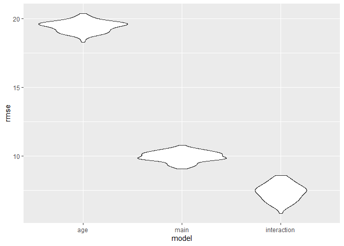

Statistical Analysis
================
Qingyue Zhuo qz2493
2022-12-01

### Selection of Predictors

- Data Cleaning

``` r
stratified = 
  read_csv("https://raw.githubusercontent.com/Serena-Wang/p8105_covid_vaccinations/main/Data/coverage_by_demo_full.csv") %>%
  janitor::clean_names() %>%
  select(group, subgroup, perc_partially, perc_fully, perc_additional) %>%
  drop_na()
```

    ## Rows: 30352 Columns: 13
    ## ── Column specification ────────────────────────────────────────────────────────
    ## Delimiter: ","
    ## chr  (3): POPULATION, GROUP, SUBGROUP
    ## dbl  (9): POP_DENOMINATOR, COUNT_PARTIALLY_CUMULATIVE, COUNT_FULLY_CUMULATIV...
    ## date (1): DATE
    ## 
    ## ℹ Use `spec()` to retrieve the full column specification for this data.
    ## ℹ Specify the column types or set `show_col_types = FALSE` to quiet this message.

``` r
unstratified = 
  read_csv("https://raw.githubusercontent.com/Serena-Wang/p8105_covid_vaccinations/main/Data/coverage_boro_demo_full.csv") %>%
  janitor::clean_names() %>%
  select(age_group, race_ethnicity, city_perc_fully) %>%
  filter(
    !age_group %in% c("Boroughwide", "All ages", "65+", "13-17", "18-44", "45-64") 
)
```

    ## Rows: 9233 Columns: 15
    ## ── Column specification ────────────────────────────────────────────────────────
    ## Delimiter: ","
    ## chr   (2): AGE_GROUP, RACE_ETHNICITY
    ## dbl  (12): CITY_COUNT_FULLY_CUMULATIVE, BX_COUNT_FULLY_CUMULATIVE, BK_COUNT_...
    ## date  (1): DATE
    ## 
    ## ℹ Use `spec()` to retrieve the full column specification for this data.
    ## ℹ Specify the column types or set `show_col_types = FALSE` to quiet this message.

#### Chi-square Test

- Boroughs

We predicted that there is no difference in vaccination rate in NYC
across the six boroughs. We will perform the chi-square test to verify
our assumption.

H0: the expected vaccination rates are the same across all boroughs.

H1: the expected vaccination rate are not same across all boroughs.

``` r
demo_boro = 
  stratified %>%
  filter(group == "Borough") %>% 
  select(-group) %>%
  group_by(subgroup) %>%
  summarise(
    partial_vaccin = mean(perc_partially),
    full_vaccin = mean(perc_fully),
    additional_vaccin = mean(perc_additional)) %>%
  filter(subgroup != "Citywide") %>%
  select(-subgroup) %>%
  data.matrix()

rownames(demo_boro) = c("Bronx", "Brooklyn", "Manhattan", "Queens", "Staten Island")

knitr::kable(demo_boro, digits = 3)
```

|               | partial_vaccin | full_vaccin | additional_vaccin |
|:--------------|---------------:|------------:|------------------:|
| Bronx         |          9.072 |      72.518 |            22.140 |
| Brooklyn      |          7.310 |      66.726 |            25.867 |
| Manhattan     |         16.164 |      84.287 |            41.053 |
| Queens        |          8.193 |      84.039 |            33.356 |
| Staten Island |          6.248 |      67.901 |            25.183 |

``` r
chisq.test(demo_boro)
```

    ## 
    ##  Pearson's Chi-squared test
    ## 
    ## data:  demo_boro
    ## X-squared = 5.4133, df = 8, p-value = 0.7126

Interpretation: The result of chi-square shows that χ2\<χcrit, at
significant level α=0.05, so we fail to reject the null hypothesis and
conclude that the vaccination rate is same across all boroughs.

- Race

We predicted that there is no difference in vaccination rate in NYC
across the six types of race. We will perform the chi-square test to
verify our assumption.

H0: the expected vaccination rates are the same across all races.

H1: the expected vaccination rates are not same across all races.

``` r
demo_race = 
  stratified %>%
  filter(group == "Race/ethnicity") %>%
  filter(
    perc_partially < 100,
    perc_fully < 100,
    perc_additional < 100
  ) %>%
  select(-group) %>%
  group_by(subgroup) %>%
  summarise(
    partial_vaccin = mean(perc_partially),
    full_vaccin = mean(perc_fully),
    additional_vaccin = mean(perc_additional)) %>%
  filter(subgroup != "Native American/Alaska Native") %>%
  select(-subgroup) %>%
  data.matrix()

rownames(demo_race) = c("Asian", "Black", "Hispanic/Latino", "Multiracial","White")

knitr::kable(demo_race, digit = 3)
```

|                 | partial_vaccin | full_vaccin | additional_vaccin |
|:----------------|---------------:|------------:|------------------:|
| Asian           |          8.961 |      93.544 |            54.313 |
| Black           |          6.813 |      57.773 |            18.627 |
| Hispanic/Latino |         11.116 |      71.999 |            21.893 |
| Multiracial     |          0.550 |       4.834 |             1.860 |
| White           |          4.715 |      55.500 |            29.519 |

``` r
chisq.test(demo_race)
```

    ## Warning in chisq.test(demo_race): Chi-squared approximation may be incorrect

    ## 
    ##  Pearson's Chi-squared test
    ## 
    ## data:  demo_race
    ## X-squared = 9.9001, df = 8, p-value = 0.2721

Interpretation: The result of chi-square shows that χ2\<χcrit, at
significant level α=0.05, so we fail to reject the null hypothesis and
conclude that the vaccination rate is same across races.

- Sex

We predicted that there is no difference in vaccination rate in NYC
across genders. We will perform the chi-square test to verify our
assumption.

H0: the expected vaccination rates are the same across genders.

H1: the expected vaccination rates are not same across all genders.

``` r
demo_sex = 
  stratified %>%
  filter(group == "Sex") %>%
  select(-group) %>%
  group_by(subgroup) %>%
  summarise(
    partial_vaccin = mean(perc_partially),
    full_vaccin = mean(perc_fully),
    additional_vaccin = mean(perc_additional)) %>%
  select(-subgroup) %>%
  data.matrix()

rownames(demo_sex) = c("Female", "Male")

knitr::kable(demo_sex)
```

|        | partial_vaccin | full_vaccin | additional_vaccin |
|:-------|---------------:|------------:|------------------:|
| Female |       8.810231 |    75.46071 |          30.82645 |
| Male   |       9.354950 |    73.69736 |          27.76276 |

``` r
chisq.test(demo_sex)
```

    ## 
    ##  Pearson's Chi-squared test
    ## 
    ## data:  demo_sex
    ## X-squared = 0.11625, df = 2, p-value = 0.9435

Interpretation: The result of chi-square shows that χ2\<χcrit, at
significant level α=0.05, so we fail to reject the null hypothesis and
conclude that the vaccination rate is same for male and female.

- age

We predicted that there is no difference in vaccination rate in NYC
across differenc age groups. We will perform the chi-square test to
verify our assumption.

H0: the expected vaccination rates are the same across age groups.

H1: the expected vaccination rate are not same across age groups.

``` r
demo_age = 
  stratified %>%
  filter(
    group == "Age",
    subgroup != "'5-12",
    subgroup != "'0-4",
    subgroup != "'13-17") %>%
  select(-group) %>% 
  group_by(subgroup) %>%
  summarise(
    partial_vaccin = mean(perc_partially),
    full_vaccin = mean(perc_fully),
    additional_vaccin = mean(perc_additional)) %>%
  select(-subgroup) %>%
  data.matrix() 

rownames(demo_age) = c("0-17", "18-24", "25-34", "35-44", "45-54", "55-64", "65-74", "75-84", "85+")

knitr::kable(demo_age, digits = 3)
```

|       | partial_vaccin | full_vaccin | additional_vaccin |
|:------|---------------:|------------:|------------------:|
| 0-17  |          6.328 |      41.527 |             8.485 |
| 18-24 |         17.723 |      88.268 |            34.335 |
| 25-34 |         12.244 |      83.049 |            35.413 |
| 35-44 |          9.924 |      92.744 |            42.806 |
| 45-54 |          7.879 |      91.979 |            48.690 |
| 55-64 |          6.877 |      92.948 |            56.518 |
| 65-74 |          6.201 |      90.296 |            63.019 |
| 75-84 |          5.526 |      79.783 |            57.055 |
| 85+   |          4.887 |      63.939 |            42.048 |

``` r
chisq.test(demo_age)
```

    ## Warning in chisq.test(demo_age): Chi-squared approximation may be incorrect

    ## 
    ##  Pearson's Chi-squared test
    ## 
    ## data:  demo_age
    ## X-squared = 36.418, df = 16, p-value = 0.002531

Interpretation: The result of chi-square shows that χ2\>χcrit, at
significant level α=0.05, so we reject the null hypothesis and conclude
that the vaccination rate is not same for difference age groups.  

Conclusion: according to the results of chi-square test, we can conclude
that age is the most significant predictor of the vaccination rate in
NYC. However, race has the second lowest p-value, so we will fit the
model with these two predictors.

### Model Fitting

We propose 2 models for prediction:

1.  Linear Model of city_perc_fully \~ age_group

2.  Linear Model of city_perc_fully \~ age_group + race_ethnicity

3.  Linear Model of city_perc_fully \~ age_group + race_ethnicity +
    age_group \* race_ethnicity, assuming that there are interaction

- Age Group Model

``` r
fit_lm_age = lm(city_perc_fully ~ age_group, data = unstratified  )
fit_lm_age  %>% broom::tidy() %>% knitr::kable(digits = 2)
```

| term            | estimate | std.error | statistic | p.value |
|:----------------|---------:|----------:|----------:|--------:|
| (Intercept)     |     2.50 |      1.77 |      1.41 |    0.16 |
| age_group’13-17 |    73.06 |      1.88 |     38.76 |    0.00 |
| age_group’18-44 |    74.81 |      1.88 |     39.70 |    0.00 |
| age_group’45-64 |    79.41 |      1.88 |     42.14 |    0.00 |
| age_group’5-12  |    42.17 |      1.88 |     22.37 |    0.00 |
| age_group’65+   |    73.94 |      1.88 |     39.23 |    0.00 |

- Main Effect Model

``` r
fit_lm_main = lm(city_perc_fully ~ age_group  +  race_ethnicity, 
                 data = unstratified )
fit_lm_main  %>% broom::tidy() %>% knitr::kable(digits = 2)
```

| term                          | estimate | std.error | statistic | p.value |
|:------------------------------|---------:|----------:|----------:|--------:|
| (Intercept)                   |    29.83 |      0.94 |     31.78 |       0 |
| age_group’13-17               |    73.06 |      0.96 |     75.93 |       0 |
| age_group’18-44               |    74.81 |      0.96 |     77.76 |       0 |
| age_group’45-64               |    79.41 |      0.96 |     82.54 |       0 |
| age_group’5-12                |    42.17 |      0.96 |     43.83 |       0 |
| age_group’65+                 |    73.94 |      0.96 |     76.85 |       0 |
| race_ethnicityBlack           |   -41.28 |      0.41 |   -100.96 |       0 |
| race_ethnicityHispanic/Latino |   -27.57 |      0.41 |    -67.43 |       0 |
| race_ethnicityWhite           |   -40.44 |      0.41 |    -98.91 |       0 |

- Interaction Model

``` r
fit_lm_interaction = lm(city_perc_fully ~ age_group  +  race_ethnicity +
                        age_group * race_ethnicity, 
                        data = unstratified )
fit_lm_interaction  %>% broom::tidy() %>% knitr::kable(digits = 2)
```

| term                                          | estimate | std.error | statistic | p.value |
|:----------------------------------------------|---------:|----------:|----------:|--------:|
| (Intercept)                                   |     4.32 |      1.33 |      3.25 |    0.00 |
| age_group’13-17                               |   110.21 |      1.41 |     78.04 |    0.00 |
| age_group’18-44                               |    97.70 |      1.41 |     69.18 |    0.00 |
| age_group’45-64                               |    96.80 |      1.41 |     68.55 |    0.00 |
| age_group’5-12                                |    79.58 |      1.41 |     56.35 |    0.00 |
| age_group’65+                                 |    89.97 |      1.41 |     63.71 |    0.00 |
| race_ethnicityBlack                           |    -3.87 |      1.88 |     -2.06 |    0.04 |
| race_ethnicityHispanic/Latino                 |    -3.77 |      1.88 |     -2.01 |    0.04 |
| race_ethnicityWhite                           |     0.38 |      1.88 |      0.20 |    0.84 |
| age_group’13-17:race_ethnicityBlack           |   -51.50 |      2.00 |    -25.79 |    0.00 |
| age_group’18-44:race_ethnicityBlack           |   -38.98 |      2.00 |    -19.52 |    0.00 |
| age_group’45-64:race_ethnicityBlack           |   -27.07 |      2.00 |    -13.55 |    0.00 |
| age_group’5-12:race_ethnicityBlack            |   -51.53 |      2.00 |    -25.80 |    0.00 |
| age_group’65+:race_ethnicityBlack             |   -22.87 |      2.00 |    -11.45 |    0.00 |
| age_group’13-17:race_ethnicityHispanic/Latino |   -33.06 |      2.00 |    -16.55 |    0.00 |
| age_group’18-44:race_ethnicityHispanic/Latino |   -17.36 |      2.00 |     -8.69 |    0.00 |
| age_group’45-64:race_ethnicityHispanic/Latino |   -11.50 |      2.00 |     -5.76 |    0.00 |
| age_group’5-12:race_ethnicityHispanic/Latino  |   -44.51 |      2.00 |    -22.29 |    0.00 |
| age_group’65+:race_ethnicityHispanic/Latino   |   -15.71 |      2.00 |     -7.87 |    0.00 |
| age_group’13-17:race_ethnicityWhite           |   -64.06 |      2.00 |    -32.08 |    0.00 |
| age_group’18-44:race_ethnicityWhite           |   -35.23 |      2.00 |    -17.64 |    0.00 |
| age_group’45-64:race_ethnicityWhite           |   -30.99 |      2.00 |    -15.52 |    0.00 |
| age_group’5-12:race_ethnicityWhite            |   -53.63 |      2.00 |    -26.85 |    0.00 |
| age_group’65+:race_ethnicityWhite             |   -25.55 |      2.00 |    -12.79 |    0.00 |

### Cross Validation

Although race is not statistically significant under the critical value
alpha = 0.05, it increases the prediction ability of the simple linear
model : lm(city_perc_fully \~ age_group). What’s more, we notice that
interaction term is contributing to model predictability as well. We
would say the interaction model will be better than the other one
because its root means square error seems to be smaller. Therefore,
interaction model could be useful for predicting the fully vaccinated
rate in NYC.

``` r
cv_df =
  crossv_mc(unstratified, 100) %>% 
  mutate(
    train = map(train, as_tibble),
    test = map(test, as_tibble))
```

``` r
cv_df = 
  cv_df %>% 
  mutate(
    age_mod = map(train, ~lm(city_perc_fully ~ age_group, data = .x)),
    main_mod  = map(train, ~lm(city_perc_fully ~ age_group  +  race_ethnicity, data = .x)),
    interaction_mod = map(train, ~lm(city_perc_fully ~ age_group  +  race_ethnicity + age_group * race_ethnicity, data = .x))) %>% 
  mutate(
    rmse_age = map2_dbl(age_mod, test, ~rmse(model = .x, data = .y)),
    rmse_main = map2_dbl(main_mod, test, ~rmse(model = .x, data = .y)),
    rmse_interaction = map2_dbl(interaction_mod, test, ~rmse(model = .x, data = .y)))
```

``` r
cv_df %>% 
  select(starts_with("rmse")) %>% 
  pivot_longer(
    everything(),
    names_to = "model", 
    values_to = "rmse",
    names_prefix = "rmse_") %>% 
  mutate(model = fct_inorder(model)) %>% 
  ggplot(aes(x = model, y = rmse)) + geom_violin()
```

<!-- -->

### Model Conclusion

Age, race and their interaction term are good predictors for
anticipating the Covid vaccination rate in NYC.
